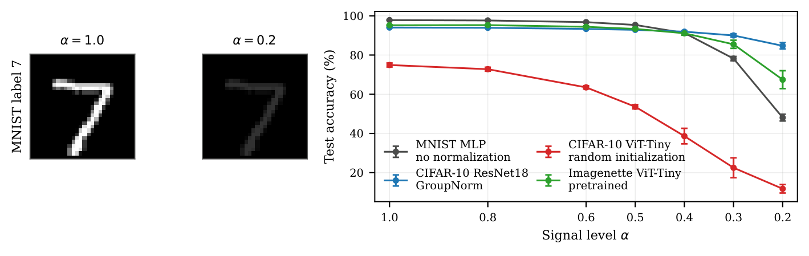
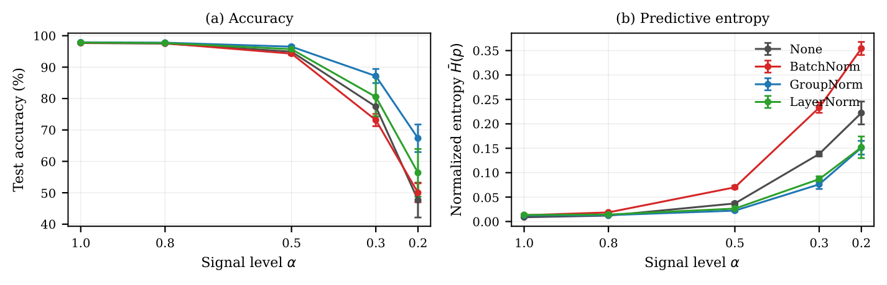
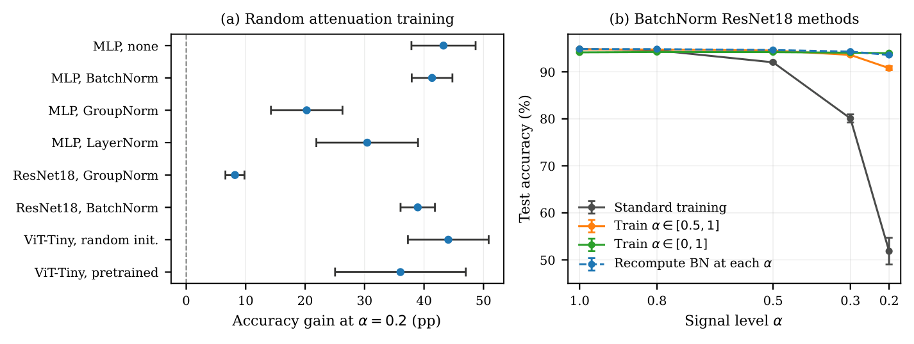

::: {.callout-tip appearance="simple"}
**The short version.** Multiply every pixel by $\alpha=0.2$ and a CIFAR-10
ResNet18 goes from 94.85% to 51.85%. Swap BatchNorm for GroupNorm, change
nothing else, and it sits at 84.72%. Recompute the BatchNorm running statistics
on unlabeled scaled images — touching no learned weight — and it goes to 93.59%.
The failure was mostly in the stored statistics, not in the features. The same
fix applied in the wrong direction, severe-level statistics on clean images,
costs more than the original failure: 17.22%.
:::

## What is the problem?

Multiplying every pixel of an image by one scalar $\alpha$ is about the most
trivial transformation available. It preserves every edge, every spatial
relationship, every ratio between pixels. For $\alpha > 0$ it is exactly
invertible — divide and you are back where you started. A human looking at an
MNIST digit at 20% signal reads the same digit.

But, common image classifiers won't. Trained on clear images, they lose accuracy steadily as
$\alpha$ falls, and at $\alpha=0.2$ the loss ranges from mild to catastrophic
depending on the model. This shows up in practice as sensor gain changes,
illumination shifts, and preprocessing differences, but I am not modeling any of
those here. The point of using a single scalar is that it gives a dose–response
curve with one knob and no confounds.

{#fig-dose}

The question I actually care about is not *that* this happens but *where the
failure lives*:

> How much of the failure is attributable to normalization statistics and
> training exposure, rather than to a genuine loss of discriminative features?

These call for different responses. If the features are gone you retrain. If the
stored statistics are simply wrong for the new input distribution, you fix them
at inference and touch nothing else. The two are distinguishable experimentally:
ask whether accuracy comes back without updating a single weight.

One caveat up front, because it limits what any of this means. The probe is
noiseless and invertible. An observer who knows $\alpha$ can just divide. So the
experiments that assume a known $\alpha$ are attribution experiments, not
deployment recipes. Real low-light acquisition brings photon noise,
quantization, and saturation, none of which appear here.

## What is already in the literature?

Replacing stored BatchNorm statistics with statistics recomputed on unlabeled
target data, weights frozen, is **AdaBN** [@li2017adabn]. Schneider et al.
[@schneider2020covariate] applied it to the ImageNet-C corruptions — which
include contrast — across many architectures, with as few as a handful of target
images. Nado et al. [@nado2020prediction] skip the adaptation pass entirely and
use the current test batch's statistics. Benz et al. [@benz2021revisiting] report
substantial recovery from corrected statistics on CIFAR-10-C with ResNets. A
global gain is close to a pure change in the first and second moments of the
activations, so a large recovery is exactly what this literature predicts.

The training-side intervention is equally standard: multiplying nonnegative
images by a factor below one is ordinary multiplicative brightness augmentation.
The sampling range and clean/scaled mixing ratio specify a particular protocol.

Why normalization is the right place to look: BatchNorm estimates running means
and variances during training and reuses them at inference [@ioffe2015batchnorm],
so those stored numbers *are* an assumption about the input distribution, baked
into the model. GroupNorm and LayerNorm compute statistics from the current
example [@wu2018groupnorm; @ba2016layernorm], which removes that assumption at
the cost of discarding absolute scale.

## The failure is silent

Before asking how to fix it, it is worth knowing what the failure looks like
from the outside — because it does not announce itself.

Take the standard BatchNorm ResNet18 and walk $\alpha$ down to zero. Note that
$\alpha=0$ does not present a zero tensor to the network: scaling happens
*before* dataset normalization, so
$\tilde{x}_\alpha = \tilde{x}_0 + \alpha x/\sigma$ with
$\tilde{x}_0 = -\mu/\sigma$. Decreasing $\alpha$ walks the input along a straight
line toward a constant image, not toward the origin.

| $\alpha$ | Accuracy (%) | Norm. entropy | Mean max. prob. |
|---|---|---|---|
| 1.0 | 94.85 | 0.031 | 0.977 |
| 0.5 | 92.03 | 0.045 | 0.966 |
| 0.3 | 80.09 | 0.087 | 0.933 |
| 0.2 | 51.85 | 0.140 | 0.894 |
| 0.1 | 14.34 | 0.326 | 0.765 |
| 0.0 | 10.00 | 0.594 | 0.539 |

: Standard-training CIFAR-10 ResNet18 with BatchNorm, ten seeds. Normalized entropy is predictive entropy divided by $\log K$; a uniform prediction would give 1.0 and a mean max probability of 0.1. {#tbl-anchor}

At $\alpha=0.2$ the model is right half the time and assigns 0.894 mean
probability to its answer. At $\alpha=0$ it is at chance and *still* puts 0.539
on a single class, given what is effectively a blank input. The zero-signal
endpoint is confident and class-biased, not uninformative — worth knowing,
because arguments about the low-signal limit sometimes assume it is uniform.

The practical reading: **substantial accuracy loss coexists with high
confidence.** Do not expect a confidence threshold to catch this for free. (I
did not evaluate any detection rule, so this is not a claim that a well-chosen
threshold *couldn't* work.)

## How general is it?

I evaluated models trained without any exposure to scaled images, across
four dataset–architecture families.

| Family | $n$ | $A(1.0)$ | Drop (pp) [95% CI] | $\bar\rho$ |
|---|---|---|---|---|
| MNIST MLP, no norm | 80 | 97.81 | 49.75 [48.03, 51.46] | 0.9995 |
| CIFAR-10 ResNet18, GroupNorm | 10 | 94.03 | 9.32 [7.81, 10.82] | 0.9979 |
| CIFAR-10 ViT-Tiny, from scratch | 5 | 74.92 | 63.13 [60.54, 65.72] | 0.9967 |
| Imagenette ViT-Tiny, pretrained | 20 | 95.19 | 27.75 [23.24, 32.27] | 0.9817 |

: Response by family. Drop is $A(1.0) - A(0.2)$ in percentage points; $\bar\rho$ is the mean within-model Spearman correlation between $\alpha$ and accuracy. {#tbl-family}

The response is **nearly monotonic everywhere** — every family mean
Spearman correlation is above 0.98. And the **magnitude varies by about a factor
of seven**, from 9.32 pp to 63.13 pp, with all four intervals mutually disjoint.

Higher clean accuracy does not buy robustness here. The MNIST MLP and the
pretrained Imagenette ViT have the highest clean accuracies (97.81%, 95.19%) and
lose 49.75 and 27.75 pp; the GroupNorm ResNet18 starts lower at 94.03% and loses
9.32. These families differ in dataset, architecture, *and* schedule at once, so
I report them separately and pool nothing. That already hints at normalization as
a factor, but it cannot isolate it.

## Attribution, part 1: hold everything fixed but the norm layer

The cleanest isolation is the smallest model. A 784–128–10 MNIST MLP, identical
in every respect except the normalization placed after the first affine map.

{#fig-norm}

Clean accuracy is essentially identical across all four (97.68–97.89%). At
$\alpha=0.2$ they separate: 47.67% with no normalization, 49.99% with BatchNorm,
**67.35% with GroupNorm**, 56.36% with LayerNorm.

Confidence behaves differently from accuracy, again. BatchNorm has the *highest*
normalized entropy at $\alpha=0.2$ (0.354) while being among the least accurate;
GroupNorm combines the best accuracy with entropy 0.151. The unnormalized and
LayerNorm models stay confident while losing accuracy — mean max probabilities
0.806 and 0.866, expected calibration errors 0.329 and 0.303.

## Attribution, part 2: the core experiment

Now the matched CIFAR-10 ResNet18 comparison. Every row shares architecture,
split, schedule, augmentation, and seeds. Rows differ only in the normalization
layer, the training distribution, or the statistics used at inference.

| Configuration | $\alpha=1.0$ | $\alpha=0.2$ |
|---|---|---|
| *Training-time differences* | | |
| BatchNorm, standard | 94.85 | 51.85 |
| GroupNorm, standard | 94.03 | 84.72 |
| BatchNorm, scaled $\mathcal{U}(0.5,1)$ | 94.75 | 90.79 |
| GroupNorm, scaled $\mathcal{U}(0.5,1)$ | 94.13 | 92.92 |
| BatchNorm, scaled $\mathcal{U}(0,1)$ | 94.14 | 93.98 |
| *Inference-time only, weights frozen* | | |
| Statistics at $\alpha=0.2$, all levels | **17.22** | 93.59 |
| Statistics per level | 94.84 | 93.59 |
| Test-batch statistics | 94.70 | 93.54 |

: Matched CIFAR-10 ResNet18, ten seeds per row. Accuracy (%). The lower block changes **no weights** — it reuses the standard-training BatchNorm checkpoints and alters only the normalization statistics used at inference. {#tbl-central}

Three readings.

**The norm layer alone moves the failure a long way.** Under identical training,
51.85% versus 84.72% at $\alpha=0.2$, even though BatchNorm was 0.82 pp *better*
at full signal. The clean-to-severe drop is 33.69 pp larger for BatchNorm
(95% CI 30.94–36.43, paired $p = 5.0 \times 10^{-10}$).

**Recomputing statistics recovers almost all of it, with frozen weights.**
51.85% → 93.59%, a paired gain of 41.74 pp (95% CI 38.96–44.52, Holm-adjusted
$p = 2.4 \times 10^{-10}$). No labels, no gradients, no weight updates — one
unlabeled pass over scaled images to reset the running means and variances.
Statistics adaptation was *sufficient*, so recovery did not need retraining. And
test-batch statistics get 93.54% without $\alpha$ being known at all.

One clarification I want to be precise about: this does not mean the
intermediate representations are unchanged. Altering normalization statistics
alters activations at every subsequent layer. No *weight* moved; plenty else did.

**A mismatched profile is worse than the disease.** Apply the $\alpha=0.2$
profile to unmodified images and you get 17.22% — a bigger loss than the one
being repaired. This is the direction people tend not to check. Per-level
statistics keep 94.84% at full signal (paired change versus standard training:
−0.01 pp, 95% CI −0.07 to 0.05).

What this does *not* establish: that every level needs its own profile. A single
profile estimated from a mixture of levels, or a coarse bank covering ranges,
might do fine. I tested neither.

## Training exposure: smaller effect, no inference-time cost

{#fig-remedies}

Training with scaled images — draw $\alpha \sim \mathcal{U}(0.5, 1.0)$ per
example, use the clean or the scaled view with equal probability — improved
severe-level accuracy in **all eight tested settings**, by 8.20 to 44.08 pp,
every paired 95% interval excluding zero. Full-signal accuracy changed by at most
0.14 pp in the MLP and ResNet18 settings, and *increased* in both ViT settings.

The part I find genuinely odd: the training distribution stops at $\alpha=0.5$.
Nothing below 0.5 is ever sampled, so evaluation at 0.2 is outside the training
range entirely, and it still transfers. I have no mechanism to offer for that and
I did not test where it stops.

Widening the range to $\mathcal{U}(0,1)$, which does cover the severe level, adds
a further 3.19 pp at $\alpha=0.2$ (95% CI 2.78–3.59) and costs 0.61 pp at full
signal (95% CI −0.75 to −0.46). A small, resolvable trade — established for
BatchNorm ResNet18 only. Combining the wider range with the fixed $\alpha=0.2$
profile made both ends worse.

## What did not work

I tried an auxiliary penalty encouraging the hidden representation to scale
linearly with $\alpha$ relative to $h(x_0)$:

$$
\mathcal{L}_{\mathrm{rep}} =
\frac{\bigl\|\,[h(x_\alpha) - h(x_0)] - \alpha[h(x) - h(x_0)]\,\bigr\|_2^2}
{\operatorname{sg}\bigl(\|h(x) - h(x_0)\|_2^2\bigr) + \epsilon}
$$

The motivation is that a ReLU network is piecewise affine
[@montufar2014linearregions], so within a single linear region
$h(x_\alpha) - h(x_0) = \alpha[h(x) - h(x_0)]$ holds exactly. Penalize the
deviation and you encourage the representation to behave predictably as the
signal fades.

Against a control performing the *identical* forward passes with the penalty
disabled, it changed accuracy at $\alpha=0.2$ by 0.62 pp in the BatchNorm MLP
(95% CI −0.10 to 1.34) and −0.20 pp in BatchNorm ResNet18 (95% CI −0.81 to 0.41).
Neither interval excluded zero. That is an absence of a detectable effect, not a
demonstration of zero — the intervals still admit about ±1 pp.

Three reasons, in hindsight, why the motivation was weaker than it looked:

1. **The premise fails exactly where I tested it.** Piecewise affinity requires
   every operation on the path to be affine at fixed activation pattern. True for
   an unnormalized ReLU net, and for BatchNorm at eval with frozen statistics.
   Not true for BatchNorm in *training* mode, whose batch statistics depend on
   the input — which is precisely the setting of the controlled tests.
2. **It constrains a trajectory, not a decision.** Satisfying the equation
   exactly says nothing about preserving the class margin. Worse, the trajectory
   it prescribes terminates at $h(x_0)$, whose prediction is itself confident and
   class-biased (see @tbl-anchor).
3. **It admits a degenerate solution.** In an exploratory GroupNorm ResNet18 run
   with a larger weight ($\beta = 0.20$), the penalty was nearly satisfied while
   accuracy sat at chance — 10.0% at both full and severe signal, for a complete
   120-epoch run. The penalty does not by itself constrain anything
   task-relevant.

A methodological note worth stealing even if the penalty is not: evaluating that
loss needs extra forward passes for $x$, $x_\alpha$, and $x_0$, and in a
BatchNorm model *every training-mode forward pass updates the running
statistics*. Comparing against standard training would have confounded the
penalty with extra statistics exposure. The matched-forward-pass control is
necessary for any auxiliary objective that adds passes to a BatchNorm model, and
it is easy to omit.

## Where I landed

For these BatchNorm ResNet18 models, the failure under global intensity scaling
is largely *addressable by adapting normalization statistics* — a statement about
where the failure lives, not a new method. Stored statistics are a part of the
model that silently assumes the input distribution they were estimated on.
Violate that assumption and the error is large; over-correct it and the error is
larger.

Two things I would take to other work:

- **Check what input distribution your stored statistics assume.** Test-batch
  statistics avoided both failure modes here (94.70% clean, 93.54% severe)
  without knowing anything about the signal level.
- **Do not treat high confidence as evidence against this kind of degradation.**

And the honest limits: all models are small, all datasets small or medium, the
probe is noiseless and invertible, the attribution is established for BatchNorm
ResNet18 and not for the GroupNorm, LayerNorm, or transformer settings, and the
augmentation protocol was never compared against other brightness-jitter
configurations. Different question.

---

::: {.callout-note collapse="true"}
## Setup details

| Dataset/model | Normalization | Seeds | Epochs | Optimizer | Batch and schedule |
|---|---|---|---|---|---|
| MNIST MLP, survey | None | 80 | 25 | Adam, $10^{-3}$ | 128, fixed LR |
| MNIST MLP, controlled | None / BN / GN / LN | 10 each | 25 | Adam, $10^{-3}$ | 128, fixed LR |
| CIFAR-10 ResNet18 | BN, GN | 10 each | 120 | SGD 0.1, mom. 0.9, wd $5\times10^{-4}$ | 256, cosine |
| CIFAR-10 ViT-Tiny, scratch | LN | 5 | 120 | AdamW $5\times10^{-4}$, wd 0.05 | 128 |
| CIFAR-10 ViT-Tiny, pretrained | LN | 5 | 20 | AdamW $2\times10^{-4}$, wd 0.05 | 128 |
| Imagenette ViT-Tiny, pretrained | LN | 20 | 20 | AdamW $2\times10^{-4}$, wd 0.05 | 64 |

Scaling is applied in raw input space before the dataset normalization
transform, on float tensors, with no requantization or clipping. Evaluation
grids: $\mathcal{A}_9 = \{1.0, 0.8, 0.6, 0.5, 0.4, 0.3, 0.2, 0.1, 0.0\}$ for the
survey and the statistics experiment, $\mathcal{A}_5 = \{1.0, 0.8, 0.5, 0.3,
0.2\}$ for the controlled comparisons. CIFAR-10 uses a fixed 45,000/5,000 split
(seed 20260721). ResNet18 has a $3\times3$ stride-one stem without max pooling.

Comparisons are paired by seed; intervals are two-sided 95% Student-$t$ and
describe seed variation on fixed datasets, not uncertainty across deployment
settings. Holm correction is applied within the BatchNorm-statistics family,
whose comparisons and endpoint were fixed in a written protocol before those runs.
The eight augmentation comparisons and the MLP curves are descriptive. ECE uses
15 equal-width bins over the max softmax probability [@guo2017calibration].
:::

## References

::: {#refs}
:::
